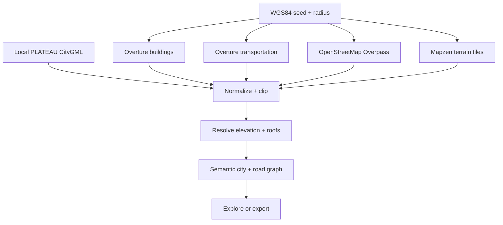

<div align="center">
  
  <h1>WorldSeed</h1>
  <p><strong>Drive a playable Three.js city from one coordinate.</strong></p>
  <p>Overture buildings + routable streets · arcade driving · game-ready GLB + data kit</p>
  <p>
    <a href="https://github.com/yz4git/next-gen/releases/tag/v0.9.1"><strong>Latest release</strong></a>
    ·
    <a href="docs/TRY_WORLDSEED.md"><strong>Try it in 5 minutes</strong></a>
    ·
    <a href="docs/SCHEMA_VERSIONING.md"><strong>Schema v1</strong></a>
    ·
    <a href="https://github.com/yz4git/next-gen/issues/19"><strong>Early adopters wanted</strong></a>
  </p>
</div>

WorldSeed turns a WGS84 latitude and longitude into a local-meter, browser-generated 3D world. Paste coordinates (or a Google Maps URL containing coordinates), choose a 100–1,000 m radius, and immediately orbit, walk, fly, or drive through the result.

Google Maps is only treated as an optional coordinate-input format. WorldSeed does not request, scrape, trace, or derive geometry from Google Maps. World geometry comes from public open-data providers.

## Why WorldSeed

WorldSeed is an open-source bridge between public geospatial data and interactive 3D applications. It is designed for developers who want a reproducible local-meter world, not a screenshot or proprietary map capture. The same generated world can be explored in-browser and exported as meshes plus structured gameplay data.

### Designed for reuse

- **Games and prototypes** — start from a generated city, road graph, colliders, routes, and spawn points instead of rebuilding map ingestion.
- **Three.js experiments** — use the included minimal Vite + Three.js starter viewer and semantic object manifests.
- **Simulation and visualization** — keep source provenance, local coordinates, semantic layers, and attribution alongside geometry.
- **Open geospatial workflows** — combine Overture Maps, OpenStreetMap, Mapzen terrain, and local PLATEAU CityGML without relying on scraped proprietary map geometry.

See [docs/REUSE.md](docs/REUSE.md) for concrete integration paths and export-file responsibilities.


*Live Tokyo Tower seed rendered by the production WebGL build from open geospatial data.*

## What works in v0.9.x — Interoperable City Export

- Overture Maps building footprints through its public PMTiles distribution
- A routable road graph built from Overture Transportation segments and connectors, with OpenStreetMap road fallback
- Arcade vehicle handling, chase camera, keyboard and touch controls, building collision, off-road drag, and recovery assist
- Deterministic checkpoint routes, time attack, per-route local best times, and opt-in exact route sharing
- Terrain-following roads with dedicated intersection patches, trimmed road mouths, curved sidewalk corners, crosswalks, trees, lights, and signs
- OpenStreetMap rail, parks, forests, pedestrian areas, and water through Overpass
- Browser-side terrain sampling from Mapzen Terrarium elevation tiles, with an offline procedural demo and flat fallback
- Separate flat, gabled, hipped, and skillion roof meshes using provider shape, height, and color tags when available
- Stable semantic layers and local-bound game-object records for terrain, areas, roads, buildings, and roofs
- 300 m runtime world tiles with distance-based base/detail visibility in Walk and Fly modes and complete-tile export
- Local-only Project PLATEAU CityGML import with EPSG:6697 coordinates and LOD1/LOD2 Ground, Wall, Roof, and Closure surfaces
- Height resolution in order: supplied height → floor count → deterministic semantic inference
- Bounded generation at 100–1,000 m with 2,500-building safety cap and merged geometry batches
- Five views: Low poly, Anime, Cyber, Blueprint, and Data quality
- Orbit, first-person walk with footprint collision, free-flight, and Drive modes
- GLB download and a zipped Three.js game kit with separated terrain, colliders, road graph, route, spawn points, and versioned JSON Schema contracts
- Always-visible viewport attribution, provenance warnings, and a per-seed height-quality meter
- IndexedDB request caching, coordinate-safe service-worker shell caching, and an offline synthetic first-run demo
- Just-in-time location disclosure, explicit share choices, privacy-safe export defaults, and local-data clearing
- iPhone Drive focus mode, enlarged touch steering controls, and consistent left/right steering direction across touch and keyboard input
- Landmark presets for Tokyo Tower, Osaka Castle, Kiyomizu-dera, the Eiffel Tower, the Statue of Liberty, Big Ben, and more
- A closable WORLD settings panel that can be reopened from every explore mode
- A cinematic Drone camera mode with swoops, altitude changes, moving focus, banking, and FOV changes
- Reversed steering mapping for the virtual pad and keyboard controls, plus hold-to-reverse braking after a full stop

## Project status

WorldSeed is an actively developed early-stage project. v0.9.1 is the current public build; v0.9.0 established the versioned export contract and independent downstream consumer example, and v0.9.1 corrected the published road-graph schema without changing schema v1 semantics. The project is actively seeking early adopters, bug reports, integration examples, and focused contributions; adoption metrics are never inferred or presented without a public link.

**Want to evaluate the contract without building WorldSeed?** Follow the [five-minute trial](docs/TRY_WORLDSEED.md): download the privacy-safe synthetic demo export and the prebuilt standalone consumer from the v0.9.1 Release, then drag the export ZIP into the consumer.

## Quick start

```bash
npm install
npm run dev
```

Open `http://localhost:4173`. The bundled demo renders immediately; select a preset or enter a coordinate and choose **Seed this world** to request live data.

Production checks:

```bash
npm run validate
```

## Controls

| Mode | Controls |
|---|---|
| Orbit | Drag to rotate, wheel to zoom, right-drag to pan |
| Walk | Click the world, then `WASD`; mouse to look; `Shift` to run |
| Fly | Click the world, then `WASD`; `Q/E` or `Ctrl/Space` for altitude |
| Drive | `W/S` throttle; virtual steering pad or `A/D`; hold `BRAKE / REVERSE` after stopping to back up; `R` resets the car |
| Drone | Cinematic automatic aerial tour; select another mode to stop |
| Any explore mode | `1`, `2`, `3`, `4`, `5` switch Orbit/Walk/Fly/Drive/Drone |

Touch devices get separate move and look sticks in Walk and Fly modes, plus steer and pedal controls in Drive mode.

Use **Import PLATEAU CityGML** for a local `.gml` or `.xml` building file up to 150 MB. The file is parsed in browser memory and is not uploaded or cached by WorldSeed. Standard-mesh files are recommended; worlds remain capped at a 1 km radius and 2,500 buildings.

## Data pipeline



The Three.js scene uses a local tangent approximation: X points east, Y points up, and Z points south. This keeps GPU coordinates stable and makes the output convenient for games. The selected coordinate is stored as export metadata only when the user explicitly opts in.

## Public safety and privacy

v0.1.1 makes coordinate disclosure an explicit action:

- Generating or changing a world no longer writes coordinates into the browser URL.
- **Use my location** explains the data flow before requesting browser permission.
- Sharing offers an app-only URL or a clearly labeled exact-seed URL.
- GLB and starter-kit exports omit the exact origin by default. An opt-in checkbox adds it when georeferencing is required.
- A permanent overlay keeps data-provider attribution visible on the world itself.
- **Clear local data & current URL** removes WorldSeed IndexedDB entries, WorldSeed shell caches, and coordinate parameters in the current tab.
- Live requests have a client-side cooldown and relevant controls are disabled during generation.

The app adds no accounts, analytics, advertising SDK, or WorldSeed API. Live generation does contact third parties: OpenStreetMap Overpass receives the exact center and radius, while requests to the Overture and Mapzen terrain datasets hosted on Amazon S3 reveal the selected tile area. Local PLATEAU import makes no provider request. Providers and the site host can receive standard network metadata such as IP addresses. See [PRIVACY.md](PRIVACY.md) for the complete data-flow summary.

Removing coordinate metadata does not anonymize recognizable street or building geometry. Review exports and screenshots before publishing them.

## Configuration

Copy `.env.example` to `.env.local` only if you need to pin a different public Overture release or PMTiles endpoint.

```dotenv
VITE_OVERTURE_RELEASE=2026-08-19.0
VITE_OVERTURE_BUILDINGS_URL=https://.../buildings.pmtiles
VITE_OVERTURE_TRANSPORTATION_URL=https://.../transportation.pmtiles
VITE_TERRAIN_TILES_URL=https://.../terrarium/{z}/{x}/{y}.png
```

OpenStreetMap requests fall back between two public Overpass instances. Public services have fair-use limits; the UI applies a short per-browser cooldown, but a high-traffic production deployment should add its own cached proxy or hosted data pipeline.

## Export contract

The starter-kit ZIP contains:

- `city.glb`, the complete rendered world
- `terrain.glb`, the terrain-only mesh
- `colliders.glb`, merged building collision boxes
- `worldseed.json` with optional origin, radius, coordinate system, source and statistics
- `worldseed-objects.json` with privacy-safe stable IDs, semantic layers, properties, and local-meter bounds
- `road-graph.json` with connector topology, direction, road class, surface, width, and speed
- `spawn-points.json` with collision-safe vehicle and pedestrian starts
- `drive-route.json` with the current deterministic time-attack route
- `ATTRIBUTION.md` generated for that seed
- `schemas/v1/*.schema.json` with machine-readable contracts for every exported JSON document
- a minimal Vite + Three.js viewer

Schema compatibility is documented in [docs/SCHEMA_VERSIONING.md](docs/SCHEMA_VERSIONING.md). The independent [export consumer example](examples/export-consumer/) imports only the ZIP contract—no WorldSeed runtime code—and renders the GLB, road graph, spawn points, and route in a separate Three.js app.

### Build something with WorldSeed

Start with the [five-minute public trial](docs/TRY_WORLDSEED.md). If you want to test the contract in another runtime, see the [cross-runtime good first issue](https://github.com/yz4git/next-gen/issues/20). Launch-ready wording for developer communities is kept in [docs/LAUNCH_KIT.md](docs/LAUNCH_KIT.md).

If you use a WorldSeed export in a public game, simulation, visualization, benchmark, or tool, open an **Integration report** issue with a reproducible link. Verified public integrations are listed in [ADOPTERS.md](ADOPTERS.md). This is the project's primary early-adopter program; no usage is counted without a public artifact.

The “Drive Any City” concept was originally described as v0.2, but the repository had already used versions 0.2–0.6 for terrain, roofs, semantic objects, streaming, and PLATEAU import. It therefore ships as v0.7.x without rewriting release history.

## License and data

WorldSeed source code is available under the [MIT License](LICENSE). Generated world data remains subject to its source licenses and attribution requirements. See [ATTRIBUTION.md](ATTRIBUTION.md), [PRIVACY.md](PRIVACY.md), and the per-export attribution file. Overture features can carry source-specific licenses; check the Overture attribution guidance for your selected region and use case.

Contributions are welcome—see [CONTRIBUTING.md](CONTRIBUTING.md). If you build a game, simulation, visualization, or tooling workflow with a WorldSeed export, a small reproducible integration example is especially useful to the project.

Project stewardship is documented in [MAINTAINERS.md](MAINTAINERS.md) and [MAINTENANCE.md](MAINTENANCE.md). Security reporting and trust boundaries are documented in [SECURITY.md](SECURITY.md) and [docs/SECURITY_MODEL.md](docs/SECURITY_MODEL.md).

Release details are tracked in [CHANGELOG.md](CHANGELOG.md).
