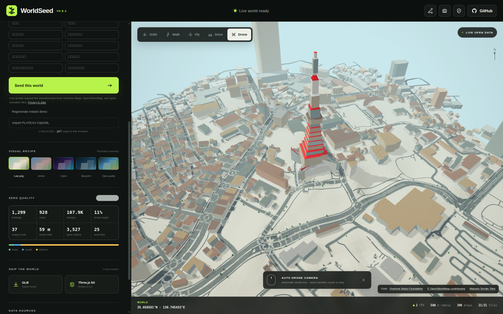
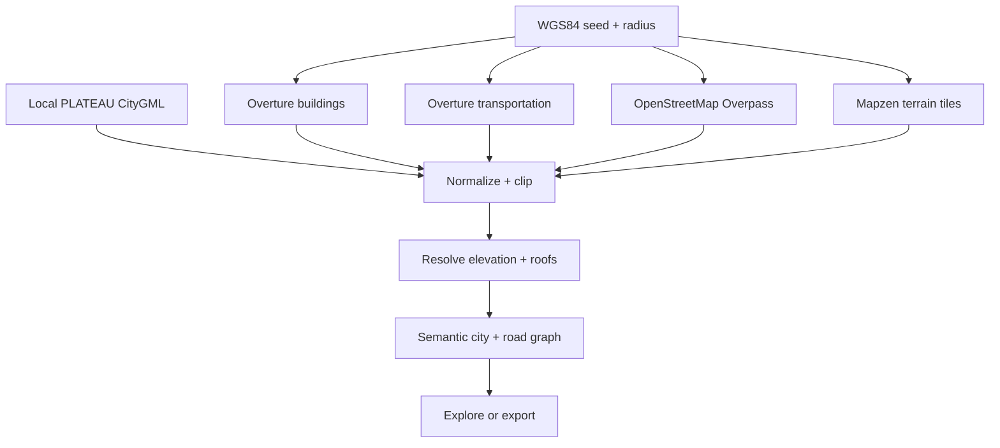

<div align="center">
  
  <h1>WorldSeed</h1>
  <p><strong>Drive a playable Three.js city from one coordinate.</strong></p>
  <p>Overture buildings + routable streets · arcade driving · game-ready GLB + data kit</p>
</div>

WorldSeed turns a WGS84 latitude and longitude into a local-meter, browser-generated 3D world. Paste coordinates (or a Google Maps URL containing coordinates), choose a 100–1,000 m radius, and immediately orbit, walk, fly, or drive through the result.

Google Maps is only treated as an optional coordinate-input format. WorldSeed does not request, scrape, trace, or derive geometry from Google Maps. World geometry comes from public open-data providers.



## What works in v0.8.0 — Drive Any City

- Overture Maps building footprints through its public PMTiles distribution
- A routable road graph built from Overture Transportation segments and connectors, with OpenStreetMap road fallback
- Arcade vehicle handling, chase camera, keyboard and touch controls, building collision, off-road drag, and recovery assist
- Deterministic checkpoint routes, time attack, per-route local best times, and opt-in exact route sharing
- Tiled sidewalks, lane markings, crosswalks, trees, lights, and signs generated along drivable streets
- OpenStreetMap rail, parks, forests, pedestrian areas, and water through Overpass
- Browser-side terrain sampling from Mapzen Terrarium elevation tiles, with an offline procedural demo and flat fallback
- Separate flat, gabled, hipped, and skillion roof meshes using provider shape, height, and color tags when available
- Stable semantic layers and local-bound game-object records for terrain, areas, roads, buildings, and roofs
- 300 m runtime world tiles with distance-based base/detail visibility in Walk and Fly modes and complete-tile export
- Local-only Project PLATEAU CityGML import with EPSG:6697 coordinates and LOD1/LOD2 Ground, Wall, Roof, and Closure surfaces
- Height resolution in order: supplied height → floor count → deterministic semantic inference
- Bounded generation at 100–1,000 m with 2,500-building safety cap and merged geometry batches
- Five views: Low poly, Anime, Cyber, Blueprint, and Data quality
- Orbit, first-person walk with footprint collision, free-flight, and Drive modes
- GLB download and a zipped Three.js game kit with separated terrain, colliders, road graph, route, and spawn points
- Always-visible viewport attribution, provenance warnings, and a per-seed height-quality meter
- IndexedDB request caching, coordinate-safe service-worker shell caching, and an offline synthetic first-run demo
- Just-in-time location disclosure, explicit share choices, privacy-safe export defaults, and local-data clearing
- iPhone Drive focus mode, enlarged touch steering controls, and consistent left/right steering direction across touch and keyboard input
- Landmark presets for Tokyo Tower, Osaka Castle, Kiyomizu-dera, the Eiffel Tower, the Statue of Liberty, Big Ben, and more
- Automatic Drone camera mode for a hands-free aerial tour of the generated city

## Quick start

```bash
npm install
npm run dev
```

Open `http://localhost:4173`. The bundled demo renders immediately; select a preset or enter a coordinate and choose **Seed this world** to request live data.

Production checks:

```bash
npm run validate
```

## Controls

| Mode | Controls |
|---|---|
| Orbit | Drag to rotate, wheel to zoom, right-drag to pan |
| Walk | Click the world, then `WASD`; mouse to look; `Shift` to run |
| Fly | Click the world, then `WASD`; `Q/E` or `Ctrl/Space` for altitude |
| Drive | `W/S` throttle and brake/reverse; virtual steering pad or `A/D`; `R` resets the car |
| Drone | Automatic aerial camera tour; select another mode to stop |
| Any explore mode | `1`, `2`, `3`, `4` switch Orbit/Walk/Fly/Drive |

Touch devices get separate move and look sticks in Walk and Fly modes, plus steer and pedal controls in Drive mode.

Use **Import PLATEAU CityGML** for a local `.gml` or `.xml` building file up to 150 MB. The file is parsed in browser memory and is not uploaded or cached by WorldSeed. Standard-mesh files are recommended; worlds remain capped at a 1 km radius and 2,500 buildings.

## Data pipeline



The Three.js scene uses a local tangent approximation: X points east, Y points up, and Z points south. This keeps GPU coordinates stable and makes the output convenient for games. The selected coordinate is stored as export metadata only when the user explicitly opts in.

## Public safety and privacy

v0.1.1 makes coordinate disclosure an explicit action:

- Generating or changing a world no longer writes coordinates into the browser URL.
- **Use my location** explains the data flow before requesting browser permission.
- Sharing offers an app-only URL or a clearly labeled exact-seed URL.
- GLB and starter-kit exports omit the exact origin by default. An opt-in checkbox adds it when georeferencing is required.
- A permanent overlay keeps data-provider attribution visible on the world itself.
- **Clear local data & current URL** removes WorldSeed IndexedDB entries, WorldSeed shell caches, and coordinate parameters in the current tab.
- Live requests have a client-side cooldown and relevant controls are disabled during generation.

The app adds no accounts, analytics, advertising SDK, or WorldSeed API. Live generation does contact third parties: OpenStreetMap Overpass receives the exact center and radius, while requests to the Overture and Mapzen terrain datasets hosted on Amazon S3 reveal the selected tile area. Local PLATEAU import makes no provider request. Providers and the site host can receive standard network metadata such as IP addresses. See [PRIVACY.md](PRIVACY.md) for the complete data-flow summary.

Removing coordinate metadata does not anonymize recognizable street or building geometry. Review exports and screenshots before publishing them.

## Configuration

Copy `.env.example` to `.env.local` only if you need to pin a different public Overture release or PMTiles endpoint.

```dotenv
VITE_OVERTURE_RELEASE=2026-08-19.0
VITE_OVERTURE_BUILDINGS_URL=https://.../buildings.pmtiles
VITE_OVERTURE_TRANSPORTATION_URL=https://.../transportation.pmtiles
VITE_TERRAIN_TILES_URL=https://.../terrarium/{z}/{x}/{y}.png
```

OpenStreetMap requests fall back between two public Overpass instances. Public services have fair-use limits; the UI applies a short per-browser cooldown, but a high-traffic production deployment should add its own cached proxy or hosted data pipeline.

## Export contract

The starter-kit ZIP contains:

- `city.glb`, the complete rendered world
- `terrain.glb`, the terrain-only mesh
- `colliders.glb`, merged building collision boxes
- `worldseed.json` with optional origin, radius, coordinate system, source and statistics
- `worldseed-objects.json` with privacy-safe stable IDs, semantic layers, properties, and local-meter bounds
- `road-graph.json` with connector topology, direction, road class, surface, width, and speed
- `spawn-points.json` with collision-safe vehicle and pedestrian starts
- `drive-route.json` with the current deterministic time-attack route
- `ATTRIBUTION.md` generated for that seed
- a minimal Vite + Three.js viewer

The “Drive Any City” concept was originally described as v0.2, but the repository had already used versions 0.2–0.6 for terrain, roofs, semantic objects, streaming, and PLATEAU import. It therefore ships as v0.7.x without rewriting release history.

## License and data

WorldSeed source code is available under the [MIT License](LICENSE). Generated world data remains subject to its source licenses and attribution requirements. See [ATTRIBUTION.md](ATTRIBUTION.md), [PRIVACY.md](PRIVACY.md), and the per-export attribution file. Overture features can carry source-specific licenses; check the Overture attribution guidance for your selected region and use case.

Contributions are welcome—see [CONTRIBUTING.md](CONTRIBUTING.md).

Release details are tracked in [CHANGELOG.md](CHANGELOG.md).
