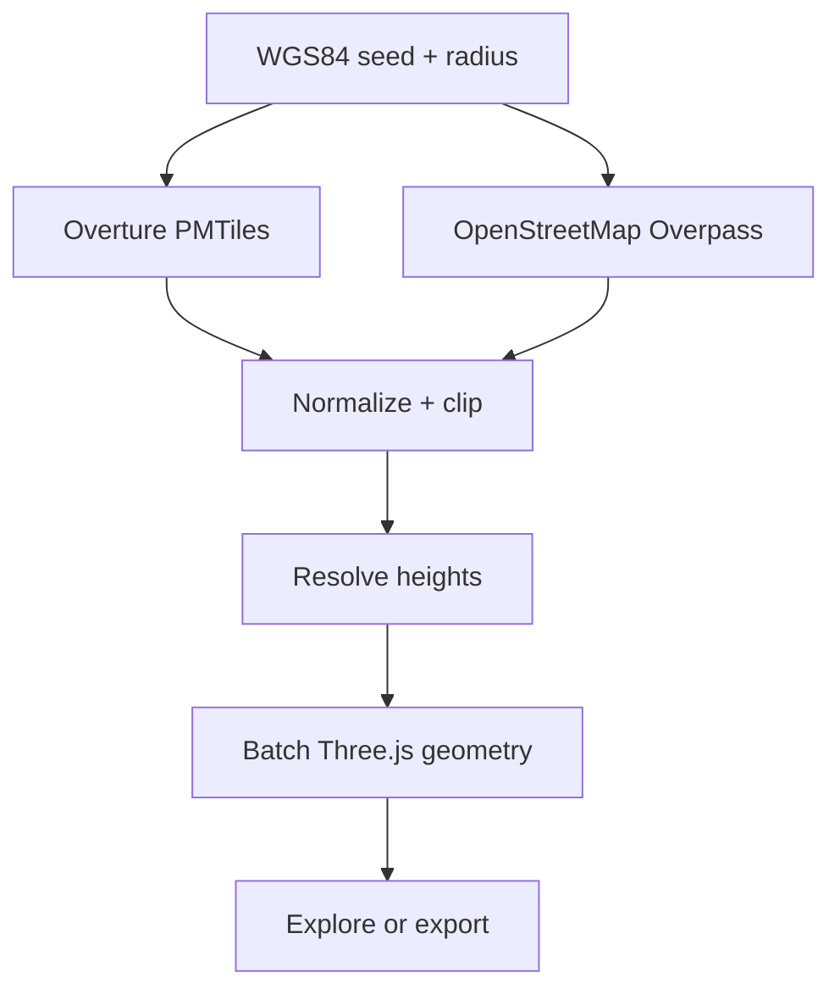

<div align="center">
  
  <h1>WorldSeed</h1>
  <p><strong>Grow a playable Three.js city from one coordinate.</strong></p>
  <p>Overture buildings · OpenStreetMap streets and land · GLB + starter-kit export</p>
</div>

WorldSeed turns a WGS84 latitude and longitude into a local-meter, browser-generated 3D world. Paste coordinates (or a Google Maps URL containing coordinates), choose a 100–1,000 m radius, and immediately orbit, walk, or fly through the result.

Google Maps is only treated as an optional coordinate-input format. WorldSeed does not request, scrape, trace, or derive geometry from Google Maps. World geometry comes from public open-data providers.


## What works in v0.1

- Overture Maps building footprints through its public PMTiles distribution
- OpenStreetMap roads, rail, parks, forests, pedestrian areas, and water through Overpass
- Height resolution in order: supplied height → floor count → deterministic semantic inference
- Bounded generation at 100–1,000 m with 2,500-building safety cap and merged geometry batches
- Five views: Low poly, Anime, Cyber, Blueprint, and Data quality
- Orbit, first-person walk with footprint collision, and free-flight modes
- GLB download and a zipped, runnable Three.js starter project
- Automatic attribution, provenance warnings, and a per-seed height-quality meter
- IndexedDB request caching, service-worker shell caching, and an offline synthetic first-run demo

## Quick start

```bash
npm install
npm run dev
```

Open `http://localhost:4173`. The bundled demo renders immediately; select a preset or enter a coordinate and choose **Seed this world** to request live data.

Production checks:

```bash
npm run validate
```

## Controls

| Mode | Controls |
|---|---|
| Orbit | Drag to rotate, wheel to zoom, right-drag to pan |
| Walk | Click the world, then `WASD`; mouse to look; `Shift` to run |
| Fly | Click the world, then `WASD`; `Q/E` or `Ctrl/Space` for altitude |
| Any first-person mode | `R` resets; `1`, `2`, `3` switch Orbit/Walk/Fly |

Touch devices get separate move and look sticks in Walk and Fly modes.

## Data pipeline



The Three.js scene uses a local tangent approximation: X points east, Y points up, and Z points south. This keeps GPU coordinates stable and makes the output convenient for games. The selected coordinate is stored as export metadata.

## Configuration

Copy `.env.example` to `.env.local` only if you need to pin a different public Overture release or PMTiles endpoint.

```dotenv
VITE_OVERTURE_RELEASE=2026-07-22.0
VITE_OVERTURE_BUILDINGS_URL=https://.../buildings.pmtiles
```

OpenStreetMap requests fall back between two public Overpass instances. Public services have fair-use limits; production deployments should add their own cached proxy or hosted data pipeline.

## Export contract

The starter-kit ZIP contains:

- `worldseed-city.glb`
- `worldseed.json` with origin, radius, coordinate system, source and statistics
- `ATTRIBUTION.md` generated for that seed
- a minimal Vite + Three.js viewer

The output is intentionally scene-only in v0.1. Terrain, roof meshes, tiled streaming, PLATEAU LOD ingestion, and semantic game-object splitting are planned extensions.

## License and data

WorldSeed source code is available under the [MIT License](LICENSE). Generated world data remains subject to its source licenses and attribution requirements. See [ATTRIBUTION.md](ATTRIBUTION.md) and the per-export attribution file. Overture features can carry source-specific licenses; check the Overture attribution guidance for your selected region and use case.

Contributions are welcome—see [CONTRIBUTING.md](CONTRIBUTING.md).
